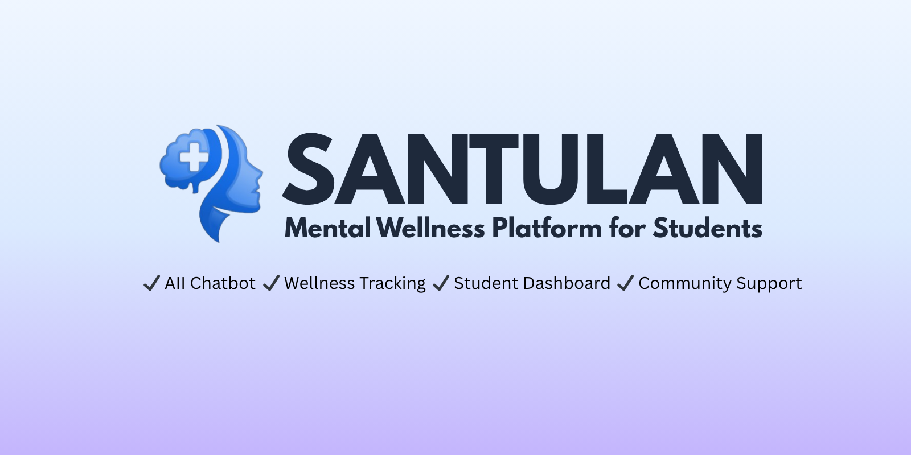
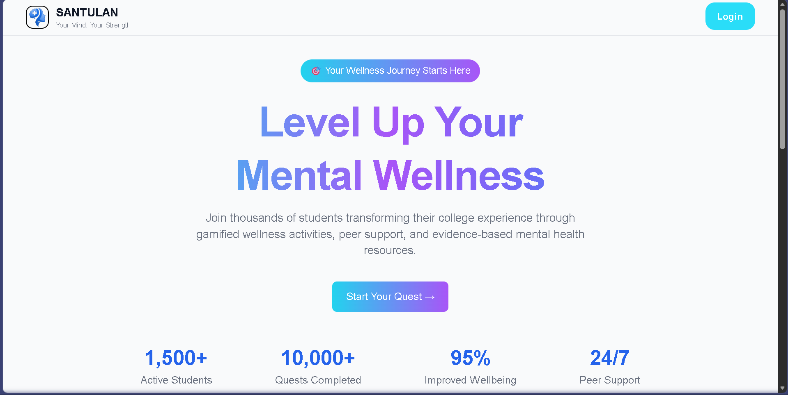
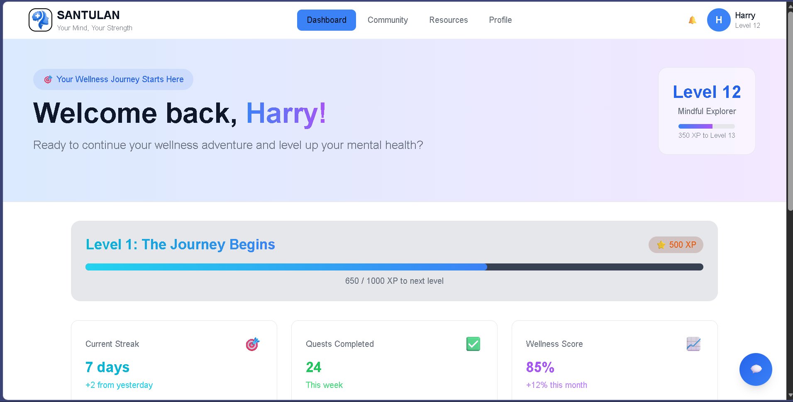
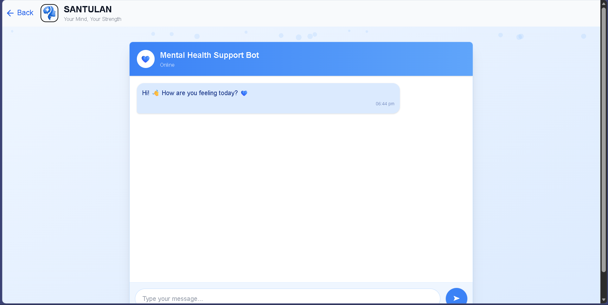
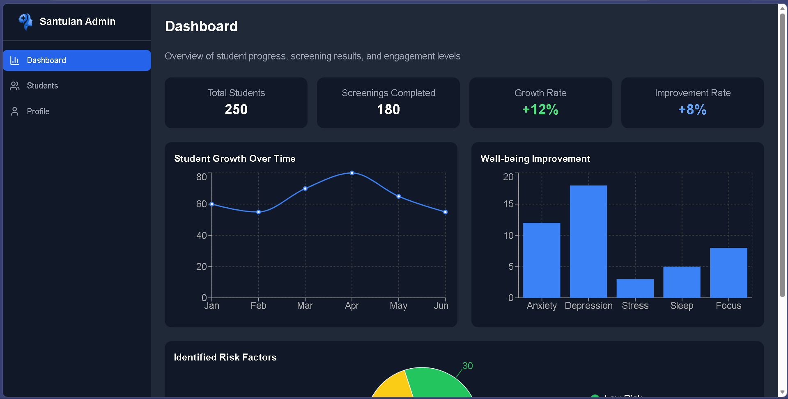

<h1 align="center">🌿 Santulan</h1>

<p align="center">
  <b>Mental Wellness Platform for Students</b><br/>
  Supporting students through wellness tracking, community support, and AI-powered mental health assistance.
</p>

---

<p align="center">
  
</p>

---

## 🚀 Features

### 👨‍🎓 Student Features
- Personalized Student Dashboard
- Daily Wellness Quests
- Mental Wellness Tracking
- AI Mental Health Support Chatbot
- Community Discussions
- Wellness Resources
  - Articles
  - Videos
  - Podcasts
- Achievement & Badge System
- Student Profile Management

---

### 🛠️ Admin Features
- Admin Dashboard
- Student Wellness Monitoring
- Student Reports & Analytics
- Risk Level Tracking
- Mental Health Progress Charts
- Recent Student Activity Logs

---

## 🧠 AI Chatbot

Santulan includes an AI-powered mental wellness chatbot built using the Gemini API.

The chatbot helps students with:
- stress management
- anxiety support
- motivation
- emotional wellness
- general mental health guidance

---

## 📊 Tech Stack

### Frontend
- React.js
- Tailwind CSS
- React Router DOM
- Recharts

### Tools & Deployment
- Vite
- Vercel

---

## 📸 Screenshots

### 🏠 Home Page



---

### 📊 Student Dashboard



---

### 🤖 AI Chatbot



---

### 🛠️ Admin Dashboard



---

## 📁 Project Structure

```bash
src/
│
├── components/
│   ├── Navbar.jsx
│   ├── AdminNavbar.jsx
│   ├── Button.jsx
│   ├── ChatButton.jsx
│   ├── ProgressBar.jsx
│   ├── ResourceCard.jsx
│   └── StatsCard.jsx
│
├── pages/
│   ├── Home.jsx
│   ├── Dashboard.jsx
│   ├── Community.jsx
│   ├── Resources.jsx
│   ├── Profile.jsx
│   ├── Login.jsx
│   ├── Signup.jsx
│   ├── Chatbot.jsx
│   ├── AdminDashboard.jsx
│   ├── StudentsList.jsx
│   ├── StudentReport.jsx
│   └── AdminProfile.jsx
│   └── NotFound.jsx
│
├── App.css
├── App.jsx
├── main.jsx
└── index.css
```

---

## ⚙️ Installation & Setup

### 1️⃣ Clone Repository

```bash
git clone https://github.com/Om-Handa/Santulan-Mental-Wellness-Platform.git
```

---

### 2️⃣ Navigate into Project Folder

```bash
cd santulan
```

---

### 3️⃣ Install Dependencies

```bash
npm install
```

---

### 4️⃣ Create Environment Variables

Create a `.env` file in the root directory:

```env
VITE_GEMINI_API_KEY=your_api_key_here
```

---

### 5️⃣ Start Development Server

```bash
npm run dev
```

---

## 🌐 Live Demo

[Visit Santulan] https://santulan-protoype.vercel.app/

---

## 🌟 Future Improvements

- JWT Authentication
- Backend Integration
- MongoDB Database
- Appointment Booking
- Mood Tracking System
- Journal Feature
- Notifications & Reminders
- Real-time Chat System

---

## 🎯 Purpose of the Project

Santulan was created to help college students manage stress, anxiety, and emotional challenges through a supportive and engaging digital platform.

The goal of the project is to make mental wellness support:
- accessible
- interactive
- student-friendly
- engaging

while encouraging students to take care of their mental health in a safe environment.

---

## 👨‍💻 Developer

Made with ❤️ by Om Handa

---

## 📄 License

This project is created for educational and learning purposes.